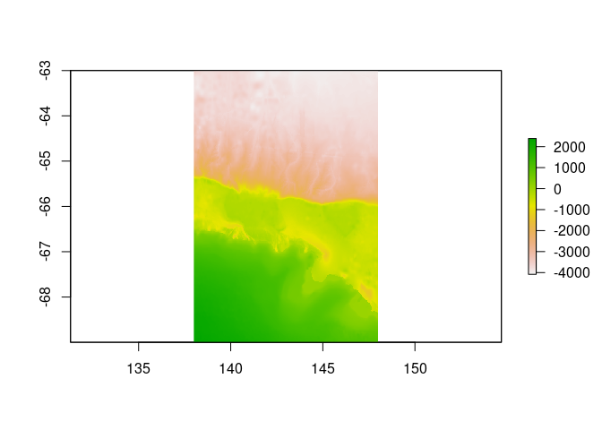
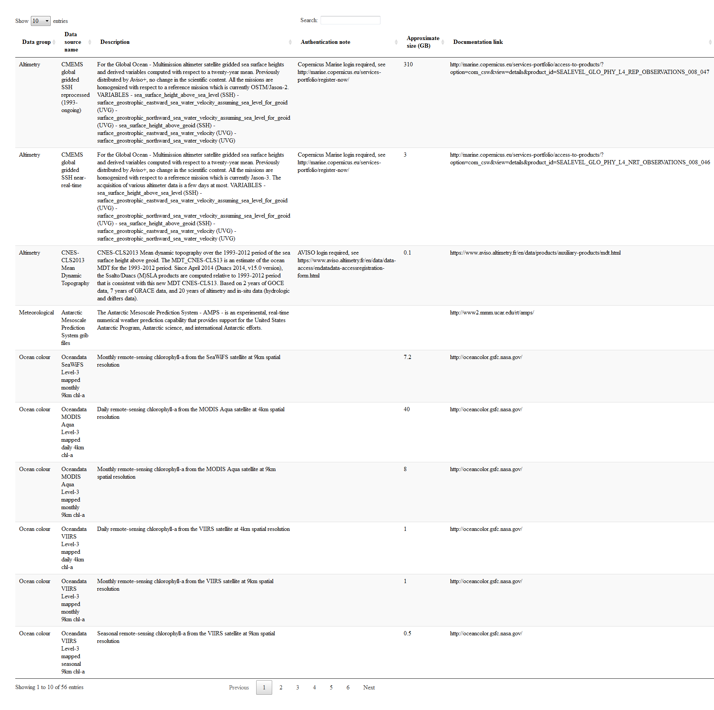

<!-- README.md is generated from README.Rmd. Please edit that file -->
[](https://travis-ci.org/AustralianAntarcticDivision/blueant) [](https://ci.appveyor.com/project/raymondben/blueant) [](https://codecov.io/gh/AustralianAntarcticDivision/blueant) <!-- [](http://www.repostatus.org/#active) --> [](http://cran.r-project.org/web/packages/blueant) 

Blueant
=======

Blueant provides a set of data source configurations to use with the [bowerbird](https://github.com/AustralianAntarcticDivision/bowerbird) package. These data sources are themed around Antarctic and Southern Ocean data, and include a range of oceanographic, meteorological, topographic, and other environmental data sets. Blueant will allow you to download data from these external data providers to your local file system, and to keep that data collection up to date.

Installing
----------

``` r
install.packages("remotes")
remotes::install_github("AustralianAntarcticDivision/blueant", build_vignettes = TRUE)
```

Usage overview
--------------

### Configuration

Build up a configuration by first defining global options such as the destination on your local file system. Usually you would choose this destination data directory to be a persistent location, suitable for a data library. For demonstration purposes here we'll just use a temporary directory:

``` r
library(blueant)
my_data_dir <- tempdir()
cf <- bb_config(local_file_root = my_data_dir)
```

Add data sources from those provided by blueant. A summary of these sources is given at the end of this document. Here we'll use the "George V bathymetry" data source as an example:

``` r
mysrc <- sources("George V bathymetry")
cf <- cf %>% bb_add(mysrc)
```

This data source is fairly small (around 200MB, see `mysrc$collection_size`). Be sure to check the `collection_size` parameter of your chosen data source before running the synchronization. Some of these collections are quite large (see the summary table at the bottom of this document).

### Synchronization

Once the configuration has been defined and the data source added to it, we can run the sync process. We set `verbose = TRUE` here so that we see additional progress output:

``` r
status <- bb_sync(cf, verbose = TRUE)
## 
## Thu Jul 12 06:32:22 2018
## Synchronizing dataset: George V bathymetry
## Source URL https://data.aad.gov.au/eds/file/4494/
## --------------------------------------------------------------------------------------------
## 
##  this dataset path is: C:/Users/ben_ray/AppData/Local/Temp/RtmpjAqcVC/data.aad.gov.au/eds/file/4494
##  building file list ... done.
## downloading file: https://data.aad.gov.au/eds/file/4494/ ...
##  file unchanged on server, not downloading.
##   decompressing: C:/Users/ben_ray/AppData/Local/Temp/RtmpjAqcVC/data.aad.gov.au/eds/file/4494/download.zip ... extracting 4 files into C:/Users/ben_ray/AppData/Local/Temp/RtmpjAqcVC/data.aad.gov.au/eds/file/4494 ... done.
## 
## Thu Jul 12 06:32:24 2018 dataset synchronization complete: George V bathymetry
```

Congratulations! You now have your own local copy of this data set. The files in this data set have been stored in a data-source-specific subdirectory of our local file root:

``` r
bb_data_source_dir(cf)
## [1] "C:/Users/ben_ray/AppData/Local/Temp/RtmpjAqcVC/data.aad.gov.au/eds/file/4494"
```

The contents of that directory:

``` r
list.files(bb_data_source_dir(cf), recursive = TRUE, full.names = TRUE)
## [1] "C:/Users/ben_ray/AppData/Local/Temp/RtmpjAqcVC/data.aad.gov.au/eds/file/4494/download.zip"    
## [2] "C:/Users/ben_ray/AppData/Local/Temp/RtmpjAqcVC/data.aad.gov.au/eds/file/4494/gvdem1000m_v3.nc"
## [3] "C:/Users/ben_ray/AppData/Local/Temp/RtmpjAqcVC/data.aad.gov.au/eds/file/4494/gvdem100m_v3.nc" 
## [4] "C:/Users/ben_ray/AppData/Local/Temp/RtmpjAqcVC/data.aad.gov.au/eds/file/4494/gvdem250m_v3.nc" 
## [5] "C:/Users/ben_ray/AppData/Local/Temp/RtmpjAqcVC/data.aad.gov.au/eds/file/4494/gvdem500m_v3.nc"
```

The data sources provided by blueant can be read, manipulated, and plotted using a range of other R packages, including [RAADTools](https://github.com/AustralianAntarcticDivision/raadtools) and [raster](https://cran.r-project.org/package=raster). In this case the data files are netcdf, which can be read by `raster`:

``` r
library(raster)
## Warning: package 'raster' was built under R version 3.4.2
## Warning: package 'sp' was built under R version 3.4.4
x <- raster(file.path(bb_data_source_dir(cf), "gvdem500m_v3.nc"))
plot(x)
```



Nuances
-------

### Choosing a data directory

It's up to you where you want your data collection kept, and to provide that location to bowerbird. A common use case for bowerbird is maintaining a central data collection for multiple users, in which case that location is likely to be some sort of networked file share. However, if you are keeping a collection for your own use, you might like to look at <https://github.com/r-lib/rappdirs> to help find a suitable directory location.

### Authentication

Some data providers require users to log in. These are indicated by the `authentication_note` column in the configuration table. For these sources, you will need to provide your user name and password, e.g.:

``` r
src <- sources(name="CMEMS global gridded SSH reprocessed (1993-ongoing)")
src$user <- "yourusername"
src$password <- "yourpassword"
cf <- bb_add(cf, src)

## or, using the pipe operator
mysrc <- bb_example_sources("CMEMS global gridded SSH reprocessed (1993-ongoing)") %>%
  bb_modify_source(user = "yourusername", password = "yourpassword")
cf <- cf %>% bb_add(mysrc)
```

### Writing and modifying data sources

The bowerbird documentation is a good place to start to find out more about writing your own data sources or modifying existing ones.

#### Reducing download sizes

Sometimes you might only want part of a data collection. Perhaps you only want a few years from a long-term collection, or perhaps the data are provided in multiple formats and you only need one. If the data source uses the `bb_handler_rget` method, you can restrict what is downloaded by modifying the arguments passed through the data source's `method` parameter, particularly the `accept_follow`, `reject_follow`, `accept_download`, and `reject_download` options.

For example, the CERSAT SSM/I sea ice concentration data are arranged in yearly directories, and so it is fairly easy to restrict ourselves to, say, only the 2017 data:

``` r
mysrc <- sources("CERSAT SSM/I sea ice concentration")

## first make sure that the data source doesn't already have an accept_follow parameter defined
"accept_follow" %in% names(mysrc$method[[1]])

## nope, so we can safely go ahead and impose our own
mysrc$method[[1]]$accept_follow <- "/2017"
cf <- cf %>% bb_add(mysrc)
```

Alternatively, for data sources that are divided into subdirectories, one could replace the whole-data-source `source_url` with one or more that point to specific yearly (or other) subdirectories. For example, the default `source_url` for the CERSAT sea ice data above is `ftp://ftp.ifremer.fr/ifremer/cersat/products/gridded/psi-concentration/data/antarctic/daily/netcdf/` (which has yearly subdirectories). So e.g. for 2016 and 2017 data we could do:

``` r
mysrc <- sources("CERSAT SSM/I sea ice concentration")
mysrc$source_url[[1]] <- c(
  "ftp://ftp.ifremer.fr/ifremer/cersat/products/gridded/psi-concentration/data/antarctic/daily/netcdf/2016/",
  "ftp://ftp.ifremer.fr/ifremer/cersat/products/gridded/psi-concentration/data/antarctic/daily/netcdf/2017/")
cf <- cf %>% bb_add(mysrc)
```

#### Defining new data sources

If the blueant data sources don't cover your needs, you can define your own using the `bb_source` function. See the bowerbird documentation.

Data source summary
-------------------

These are the data source definitions that are provided as part of the blueant package.


